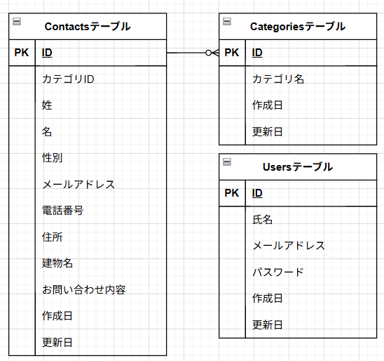

お問い合わせフォーム

## 環境構築

1 docker-compose up -d --build
2 composer install
3 .env.example をコピーし環境変数を変更

## 使用技術（実行環境）

・PHP 8.0
・Laravel 10/0
・Mysql 8.0

## ER 図

## URL

・開発環境：http://localhost/
・phpMyAdmin：http://localhost:8080;
# KakuninTest
